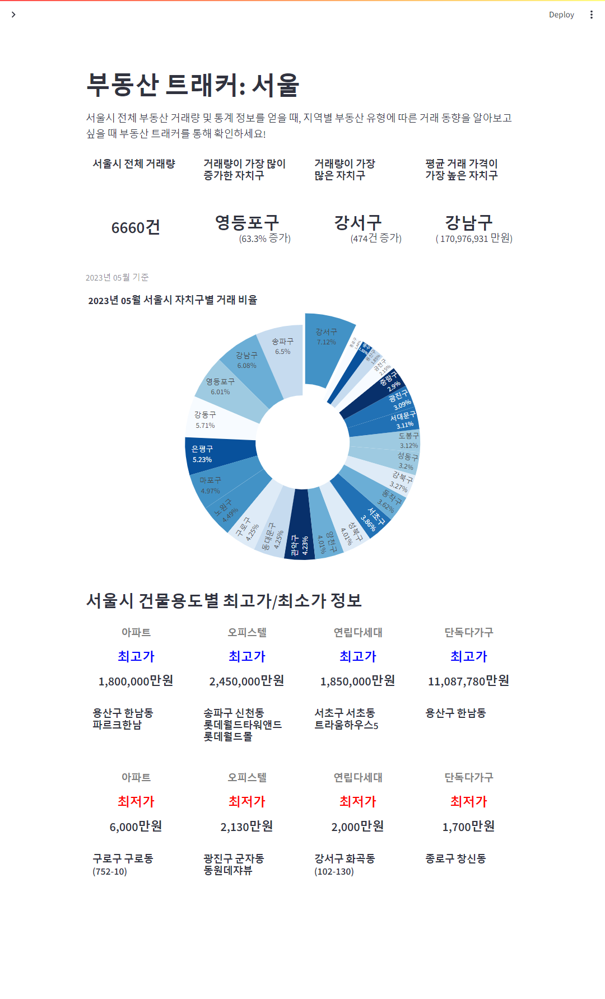
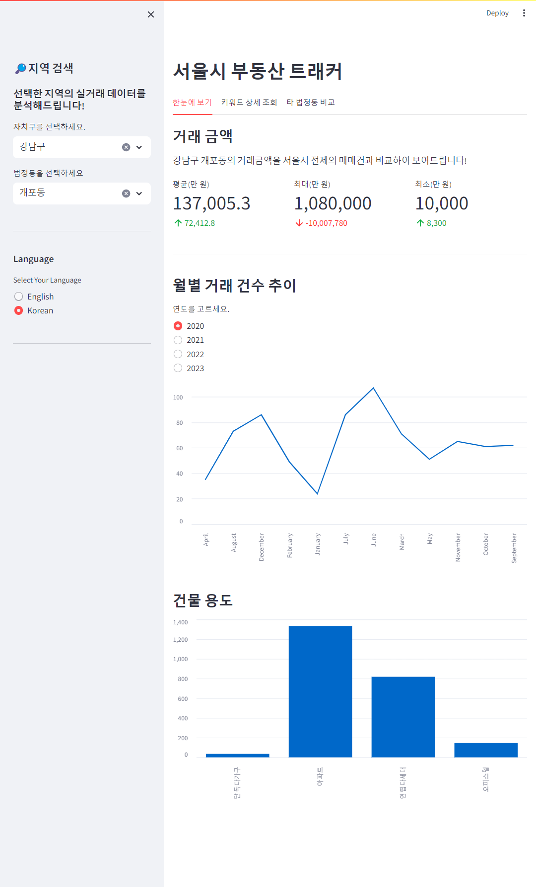
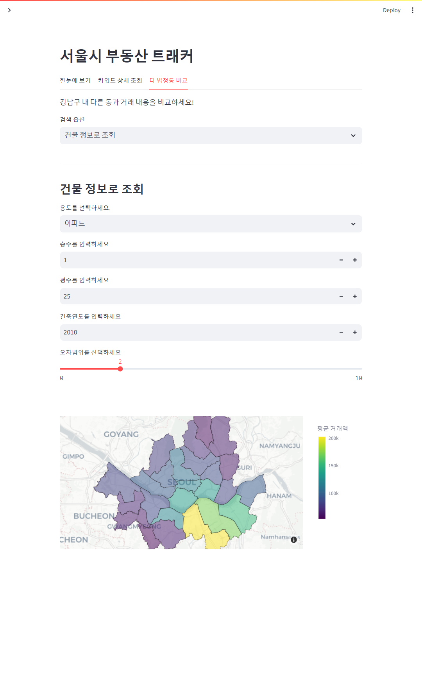

# miniproject/부동산 적정 가격 정보 제공 프로젝트/ 부동산 트래커 : 서울

# 기획배경
- 현재 국토교통부와 한국부동산원이 발표하는 주택 거래량은 통계청 승인 통계
    > 거래 당사자가 시·군·구청에 거래신고를 한 '신고일' 기준으로 수치가 집계된다.
- 반면 서울시가 서울부동산정보광장에 공개하는 통계
    > 매일 갱신되는 국토부 실거래가신고 자료를 '계약일' 기준으로 따로 분류해 수치를 공개된다
- 아직 통계 정보에 혼란이 존재
    정확한 부동산 실거래가 자료 파악은 시장가격 형성에 필수적인 절차이다.
- 특히 정보 범위가 자세할수록 가격형성 시 오류가 줄어든다.
- 지역별/건물용도별로 서울시 부동산 거래 동향을 파악할 수 있는 사이트에 대한 수요가 높아질 것으로 예측된다
    > 사용자가 서울시의 전반적인 부동산 상황을 확인하고, 필요한 정보를 카테고리별로 분류해 확인할 수 있는 대시보드 계획해보자.

# 프로젝트의 목적
- 본 프로젝트는 2020년부터 2023년까지의 데이터를 바탕으로 서울시 부동산 실거래가 정보를 확인하여 판매 예정자의 부동산 책정 가격 책정을 돕는 유의미한 정보 제공을 목표로 한다.
-  이를 위해 사용자에게 세분화도니 지역(구 -> 동)을 기준으로 세부 분석 내용을 제공한다.
    > 한눈에 보기 탭에서 거래 금액 분석, 월별 거래 건수 추이, 건물 유형별 거래 데이터를 시각화하여 제공하고 있다.
    > 키워드 상세 조회 탭에서 관심 키워드를 선택하여 키워드 내 유형별로 요약 정보와 전체 내용을 제공하고 있다.
    > 타 법저동 비교 탭에서 관심지역의 거래 내용을 자치구 내 타 동과 비교할 수 있다.
        >> 건물 정보로 조회 옵션으로 특정 건물 조건에 부합하는 자치구 내의 실거래건을 서울시 지도 위에 시각화하여 제공하고 있다.
        >> 건물 가격으로 조회 옵션으로 건물 가격 범위를 설정하고, 설정한 범위 내에 해당하는 자치구 내 타 법정동의 모든 데이터를 확인할 수 있다.

## 팀원 소개
- 나한울 팀장 : 깃허브 주소 공유
- 김영환 팀원 : https://github.com/younghwangit/
- 양인선 팀원 : https://github.com/swflora/miniproject_2024
- 이상훈 팀원 : 깃허브 주소 공유
- 정소영 팀원 : 깃허브 주소 공유
- 황유진 팀원 : https://github.com/yellayujin/


# 본 프로젝트에서 사용한 주요 개발환경 요약
  + Programming Languages : Python(ver. 3.12.1)
  + Web Framework : Streamlit (ver. 1.31.0)

## 주요 라이브러리 버전
  + [requirements.txt](requirements.txt) 파일 참조


## 테스트 준비 및 방법
- 원격 저장소의 주소를 복사한 다음 로컬 환경에 복제합니다.

```zsh
git clone "본인의 원격저장소 주소를 입력하시오"   
```

- 폴더 최상위 경로에서 가상환경을 설치합니다.

```zsh
pip install virtualenv # 기존에 설치한 가상환경이 있다면 생략 가능
virtualenv venv
```

- 가상환경에 접속합니다.
```zsh
source venv/bin/activate
```

- 라이브러리를 설치합니다.
```zsh
pip install -r requirements.txt # 가상환경 내에서 설행
```

- 일반적인 파이썬 `.py` 파일을 실행할 경우
```zsh
python a.py #  가상환경 내에서 설행
```

- Streamlit 파일 `.py` 파일을 실행할 경우
```zsh
streamlit run app.py # 가상환경 내에서 실행
```


# 데모페이지
- Streamlit에서 구현한 Demo는 다음과 같습니다.
  + https://_______.streamlit.app/

## 주요 기능
 - 본 프로젝트에서 자체 개발 및 활용한 주요 메서드는 다음과 같습니다.

| Functions | Location | Description |
|---|---|---|
| main | app.py  | for deploy |
| load_data | data_collect.py | for loading dataset and creating new columns |

### main()
- [app.py](app.py) 파일 참조

- 첫 페이지에서는 서울시 전체 부동산 실거래 데이터를 분석한 결과를 보여준다.

- 사이드바에서 원하는 자치구와 법정동을 선택
    > 해당 지역의 실거래 데이터를 분석한 결과를 보여준다.

- `sgg_nm_sort: 자치구`

- `selected_sgg_nm: 선택된 자치구 `

- `selected_bjdong_nm: 선택된 법정동`

- `filtered_data: 선택된 자치구와 법정동 데이터`

- 결과 이미지
<p align = "center" width = "100%">
  
  
  
  
</p>

### load_data():
- [data_collect.py](data_collect.py) 파일 참조

- `load_data()` 함수는 전처리된 데이터의 데이터프레임을 추가 가공하는 함수이다.

- `DEAL_YMD` 컬럼의 데이터를 문자열 데이터로 변환하여 형식을 통일했다.

- `BLDG_AREA` 데이터를 활용하여 `Pyeong` 데이터를 생성하고 `Range()` 함수를 통해 범주화했다.

- `df: csv파일의 형태로 출력한 데이터셋`

- `DEAL_YMD: 계약일`

- `Pyeong: 평수 (BLDG_AREA/3.3)`

- `Pyeong_range: 평수를 10평 단위로 범주화`


## 코드 에러 문의 
- 메뉴 `Issues`-`New Issues`-#`메모 남기기`-`Submit new issue`
- email : higari0525@gmail.com


# 발표자료 PDF 
- 공모전에서 입상한 발표자료 PDF는 아래와 같습니다.
  + [00발표자료_2024](portfolio.pdf)


## License
[](https://opensource.org/licenses/MIT)


